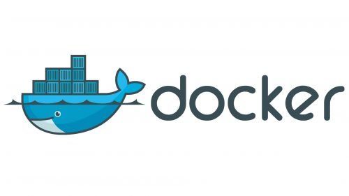

Title: Docker Compose makes containers simple and fun
Date: 2025-06-18 08:45
Modified: 2025-06-19 14:30
Category: Docker
Tags: docker, compose, containers, networking, services, ingress, load balancer, docker engine
Slug: docker-compose-makes-containers-simple-and-fun
Authors: Craig Derington
Summary: Who's managing your containers?


#### Docker Compose: Making Containers Simple and Fun!



Why Docker Compose?

Docker Compose uses a single file ```docker-compose.yml``` to describe how multiple containers should work together. Instead of running lots of complicated Docker commands, you write one file, type docker-compose up, and boom—your app is running! It’s perfect for setting up apps with multiple parts, like a website, a database, and a helper tool, all talking to each other.

#### Getting Started with Docker Compose

First, you need Docker and Docker Compose installed. On most systems, Docker Desktop includes Compose. Then, you create a docker-compose.yml file to describe your containers.

My Docker Hub repository at https://hub.docker.com/u/craigderington. 

#### Example 1: A Simple Python Web App

Python web app using craigderington/flaskdock:latest. 

You want it to run with a web server. Here’s a docker-compose.yml to set it up:

```
version: '3.8'
services:
  python-app:
    image: craigderington/docker-python
    ports:
      - "5000:5000"
    volumes:
      - ./app:/app
    environment:
      - FLASK_ENV=development
```

What’s happening?

- Toy box: A container running your craigderington/docker-python image.

- Ports: Connects port 5000 on your computer to port 5000 in the container, so you can visit your app in a browser.

- Volumes: Shares your local app folder with the container, so your code updates instantly.

- Environment: Tells the app it’s in “development” mode.

Run it with:

```
docker-compose up
```

Visit http://localhost:5000 to view the app.

#### Example 2: Node.js App with Nginx

Node and nginx images are perfect for a Node.js app with a web server. Let’s make them team up:

```
version: '3.8'
services:
  node-app:
    image: node:current-alpine3.22
    ports:
      - "3000:3000"
    volumes:
      - ./node-app:/app
    environment:
      - NODE_ENV=production
  nginx:
    image: nginx:stable-perl
    ports:
      - "80:80"
    depends_on:
      - node-app
    volumes:
      - ./nginx.conf:/etc/nginx/nginx.conf
```

#### Example 3: Python App with Database
Let’s combine your craigderington/docker-python with a PostgreSQL database for a full-stack app:


```
version: '3.8'
services:
  python-app:
    image: craigderington/docker-python
    ports:
      - "5000:5000"
    environment:
      - DATABASE_URL=postgres://user:password@db:5432/mydb
    depends_on:
      - db
  db:
    image: postgres:latest
    environment:
      - POSTGRES_USER=user
      - POSTGRES_PASSWORD=password
      - POSTGRES_DB=mydb
    volumes:
      - db-data:/var/lib/postgresql/data
volumes:
  db-data:
```

#### Why Docker Compose is Awesome

Docker Compose is like a magic wand for your containers. Instead of juggling multiple docker run commands, you write one file, and Compose handles the rest. It’s perfect for:

- Testing: Spin up a whole app (web, database, etc.) in seconds.
- Development: Share your docker-compose.yml with teammates for consistent setups.
- Learning: Play with different images without breaking anything.

To stop your containers:

```
docker-compose down
```

To remove containers and volumes:

```
docker-compose down -v
```

#### Portainer to Manage the Fleet

[Portainer](https://www.portainer.io/)

Launch a portainer agent:


```
docker run -d \
  -p 9001:9001 \
  --name portainer_agent \
  --restart=always \
  -v /var/run/docker.sock:/var/run/docker.sock \
  -v /var/lib/docker/volumes:/var/lib/docker/volumes \
  -v /:/host \
  portainer/agent:2.27.6

```
